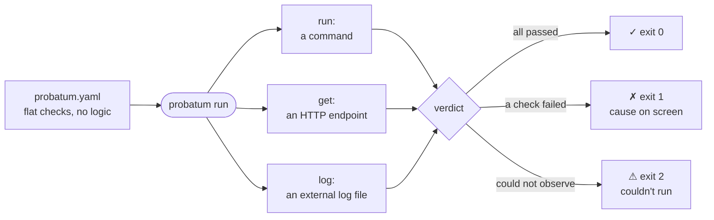
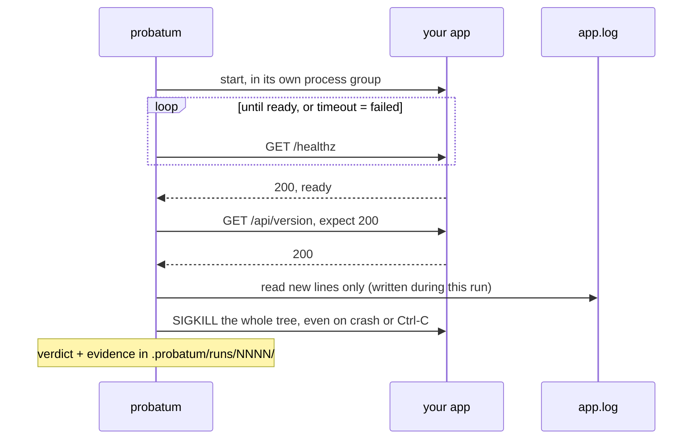

# probatum

Test-oriented runner: **one config file, embedded checks, only the failures
that matter**. Like a Makefile or Taskfile, but built for verification — the
curl, the grep and the process supervision are built in; you declare the rules
that make a check pass or fail.

```bash
probatum init                       # drop a commented example probatum.yaml
probatum run                        # runs ./probatum.yaml (like make & Makefile)
probatum run --json                 # machine verdict (agents, CI)
cat some.yaml | probatum run -      # config from stdin — no temp file
```

One file in, one verdict out:



Convention: `probatum.yaml` at the repo root is the default config;
`.probatum/` holds secondary check files (committed) and `.probatum/runs/`
the evidence of each run (ignored).

## The config

A check = one **source** + flat **rules**. No logic, no nesting, no plugins.

```yaml
# setup is just a check: an operation + rules (here: exit 0)
- name: clean slate
  run: docker compose down -v --remove-orphans

# commands — exit code is the authority
- run: cargo test
- run: cargo clippy -- -D warnings

# a service — start it, wait until it answers, keep it alive for what follows
- name: api boots
  run: ./target/debug/myapp --port 8080
  ready: http://127.0.0.1:8080/healthz
  timeout: 15
  allow: ["migration pending"]        # known noise, ignored by the crash filter

# embedded curl
- get: http://127.0.0.1:8080/api/version
  expect: 200
  contains: ['"version"']

# embedded grep — external log file, only lines written during THIS run
- name: app log is clean
  log: /var/log/myapp/app.log
  contains: ["migrations applied"]
  absent: ["ERROR", "panic"]
```

Sources: `run:` (command), `run:` + `ready:`/`timeout:` (service), `get:`
(HTTP), `log:` (external file). Rules: `expect` (HTTP status), `contains`
(must appear), `absent` (must not appear), `allow` (exempt lines from the
service crash filter), `name` (display label). Unknown keys are rejected —
a typo must never silently skip a check.

What a run looks like — probatum owns everything it starts:



## The contract

- **Defaults per source** — `run`: non-zero exit fails; explicit
  `contains`/`absent` apply to the output even on exit 0; no implicit crash
  markers (a passing `cargo test` may print "panicked at"). **Service**: the
  crash filter (panic, traceback, FATAL) is on by default — there is no exit
  code to trust while it runs. **`get`**: omitted `expect` = any 2xx.
  **`log`**: at least one rule required.
- **failed ≠ couldn't run** — a bad result (`✗`, exit 1) is not the same as
  "couldn't observe" (`⚠`, exit 2: missing binary, unreachable URL, log file
  replaced/truncated mid-run, dirty environment). A false "failed" makes you
  chase ghosts.
- **Log window** — `log:` files are read from their size at run start; only
  new lines count. Pre-existing content is normal. Replacement or truncation
  during the run makes the window ambiguous → couldn't-run.
- **Clean environment, detected not destroyed** — if the `ready:` URL already
  answers before the service starts, the run refuses (`environment not
  clean`). probatum never purges what it doesn't own: your cleanup is your
  own first `- run:` check.
- **Stop at first failure** — later checks are marked skipped; no cascade
  noise.
- **Ownership** — every process starts in its own process group and the whole
  group is killed on **every** exit path: normal end, probatum panic, SIGINT
  (Ctrl-C) or SIGTERM. If probatum dies, nothing it started survives. No
  zombie port between runs.
- **Evidence** — every run writes `.probatum/runs/NNNN/`: frozen config, one
  log per check, `run.json` (versioned `schema` field).

Exit codes: `0` all passed · `1` at least one check failed · `2` couldn't run
(invalid config, dirty environment, tool error).

## Demo

`demo-app/` is an event-sourced app whose unit tests mock the store: they
pass, but the real boot replays the WAL. Break it and watch the cause surface:

```bash
rm demo-app/data/wal/segment-0004.json
probatum run .probatum/dev-check.yaml
#   ✓ bash demo-app/tests/run.sh (test result: ok. 142 passed)
#   ✗ app boots (crashed at startup after 0.3s)
#       FATAL boot aborted: cannot rebuild state without segment 0004
```

The repo also dogfoods itself: `probatum run` at the root builds, lints, runs
the demo end-to-end and asserts the negative scenarios are caught (exit 1).

## What probatum will never be

No dependency graphs, no conditions or logic in the config, no log
aggregation, no plugin system, no CI orchestration. The day the config needs
an `if`, the design has failed. Build/deploy stay in your Makefile; probatum
takes the verification.

## Adopting probatum in a repo

Two ready-to-paste blocks. The tool is self-describing (`probatum --help`
covers the full config surface), so neither block depends on external docs.

**1. For every future AI session** — drop this in the target repo's
`CLAUDE.md` (or `AGENTS.md`; agents get this injected into context, unlike
the README):

```text
## Verification
This repo uses probatum (test-oriented check runner).
- Verify ANY change with `probatum run` — exit 0 = pass, 1 = a check failed
  (cause on screen), 2 = couldn't run (fix the environment, don't force).
- Config: `probatum.yaml` at the root — flat checks (run/get/log +
  contains/absent/expect). `probatum --help` documents the full surface.
- Parsing results? `probatum run --json`.
- New behavior or bugfix → add a check to probatum.yaml, not an ad-hoc script.
```

**2. One-time migration** — paste this prompt to your agent in the target
repo:

```text
Adopt probatum in this repo (run `probatum --help` first — it documents the
whole config surface):
1. Run `probatum init`.
2. Migrate the VERIFICATION targets from the Makefile/Taskfile/scripts into
   probatum.yaml: smoke tests, service boot + healthchecks, HTTP checks,
   log greps. Leave build/deploy targets where they are.
3. Add the probatum Verification section to this repo's CLAUDE.md.
4. Prove it before finishing: `probatum run` must pass green, AND
   deliberately breaking the service must be caught (exit 1).
```

## Packaging

```bash
cargo build --release --target x86_64-unknown-linux-musl   # static binary, ~1 MB, runs on any Linux
docker build -t probatum .                                  # alpine + binary, ~14 MB
cat some.yaml | docker run -i --rm probatum run -           # containerized run
```

The image ships probatum and a busybox shell only — project toolchains
(cargo, python…) belong to the pipeline's own images. Intended as the base for
a [cidx](https://github.com/cidx-org/cidx) preset: `cidx run test` includes
probatum; the inner dev/agent loop keeps calling `probatum run` natively.

## Next

New rules/sources only against real, recurring needs (e.g. `expect: [200, 204]`).
