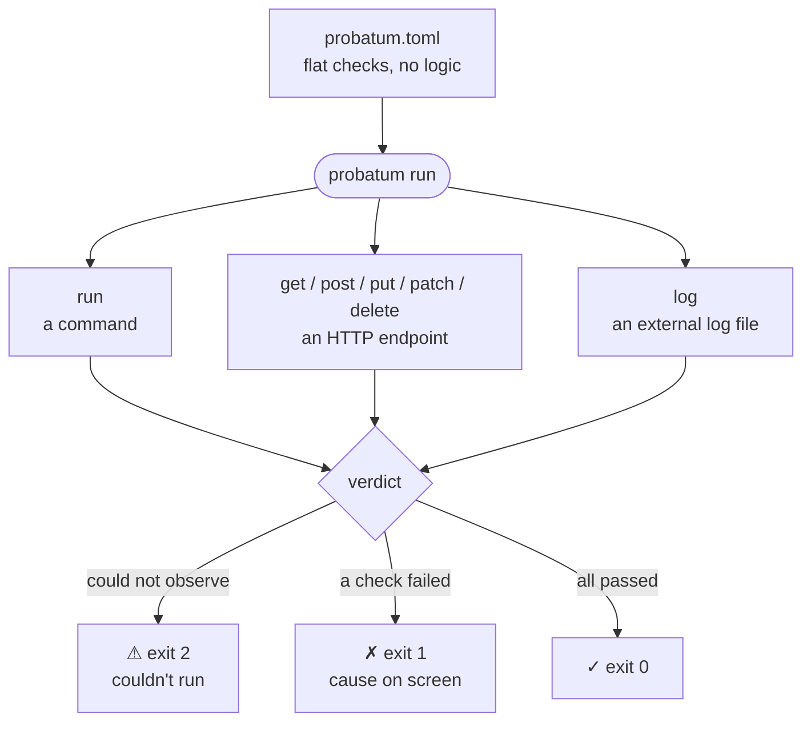
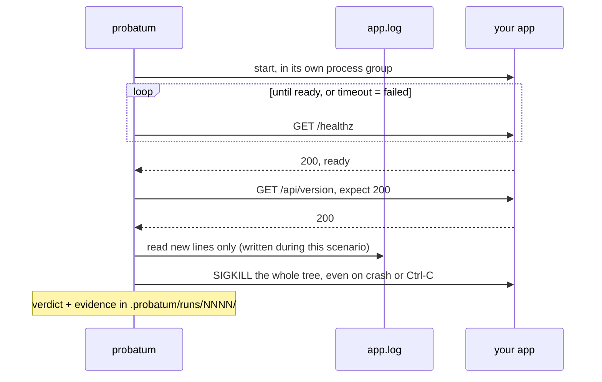

# probatum

Test-oriented runner: **one config file, embedded checks, only the failures
that matter**. Like a Makefile or Taskfile, but built for verification — the
curl, the grep and the process supervision are built in; you declare the rules
that make a check pass or fail.

```bash
# install (Linux x86_64, no toolchain needed)
curl -sSfL https://github.com/probatum-org/probatum/releases/latest/download/probatum-x86_64-linux \
  -o ~/.local/bin/probatum && chmod +x ~/.local/bin/probatum

probatum init                       # drop a commented example probatum.toml
probatum run                        # runs ./probatum.toml (like make & Makefile)
probatum run --scenario auth        # select one named scenario
probatum run --json                 # machine verdict (agents, CI)
cat some.toml | probatum run -      # config from stdin — no temp file
```

One file in, one verdict out:


```mermaid
flowchart TB
    Y["probatum.toml<br>flat checks, no logic"] --> P(["probatum run"])
    P --> R["run<br>a command"]
    P --> G["get / post / put / patch / delete<br>an HTTP endpoint"]
    P --> L["log<br>an external log file"]
    R --> V{"verdict"}
    G --> V
    L --> V
    V -- could not observe --> NR["⚠ exit 2<br>couldn't run"]
    V -- a check failed --> KO["✗ exit 1<br>cause on screen"]
    V -- all passed --> OK["✓ exit 0"]
```

Convention: `probatum.toml` at the repo root is the default config;
`.probatum/` holds secondary check files (committed) and `.probatum/runs/`
the evidence of each run (ignored).

## The config

A check = one **source** + flat **rules**. No branching, nested check logic, or
plugins. Group checks into named scenarios:

```toml
[smoke]
run = "cargo test"
timeout = 600

[auth]
os = "linux"

[auth.1]
run = "./myapp --port 8080"
ready = "http://127.0.0.1:8080/healthz"
timeout = 15

[auth.2]
post = "http://127.0.0.1:8080/login"
body = '{"username":"editor","password":"secret"}'
expect = 200

[auth.3]
get = "http://127.0.0.1:8080/account"
expect = 200
```

A single operation and its rules go directly in `[smoke]`; `os` belongs there
too when needed. For several operations, use `[auth.1]`, `[auth.2]`, etc. Each
step has its own source and rules; multiple steps may use `run`. No `check` wrapper
is needed. Numbers are positive integers without leading zeros; gaps are allowed.
Do not mix a direct operation and numbered steps in the same scenario.

`probatum run` runs scenarios in order of first appearance, with capture producers
before their consumers, and numbered steps
in ascending numeric order, regardless of where their blocks appear in the file.
`probatum run --scenario auth` selects that scenario and its capture prerequisites. Names are
case-sensitive; unknown names and duplicate selectors are errors. Each scenario
owns its services, cookie jar, and log observation window, so it can run alone.
Services are stopped before the next scenario begins. Files, databases, and
other application state are not reset implicitly; setup is an explicit check.

`os` is an optional applicability criterion: `linux`, `macos`, or `windows`.
It describes the OS where probatum executes (inside the container, if any),
not an expression or an environment-variable substitution. Recognizing an OS
name does not add platform support: the runner currently uses Unix APIs.
Without `os`, the scenario applies on any supported host.

An independent command, HTTP, or log check may also declare `os`. It cannot
conflict with the scenario's OS. Put the scope of a service and its dependent
checks on the whole scenario; `os` on a service check is rejected. Excluded checks
do not start processes, probe URLs, or open target logs. The entire configuration
is validated before filtering, so an excluded scenario cannot hide a typo.

Short steps can also be written inline using ordinary TOML. The following is
equivalent to `[auth.1]` and `[auth.2]`, with the scope declared just once:

```toml
[auth]
os = "linux"

1 = { run = "./myapp --port 8080", ready = "http://127.0.0.1:8080/healthz" }
2 = { get = "http://127.0.0.1:8080/account", expect = 401 }
```

Existing root `[[check]]` and `check = [...]` files continue to work as one
scenario named `default`. Use either that form or named scenarios in a file;
mixing them is an error, and `check` is reserved at the root. Scenarios must have
at least one check. The following example uses the existing single-scenario form:

```toml
# setup is just a check: an operation + rules (here: exit 0)
[[check]]
name = "clean slate"
run = "docker compose down -v --remove-orphans"

# commands — exit code is the authority
[[check]]
run = "cargo test"
timeout = 600                        # kill it after N seconds and fail

[[check]]
run = "cargo clippy -- -D warnings"

# asserting a non-zero exit is a rule, not a shell detour
[[check]]
name = "the migration refuses a dirty database"
run = "./migrate --check"
expect = 2

# a service — start it, wait until it answers, keep it alive for what follows
[[check]]
name = "api boots"
run = "./target/debug/myapp --port 8080"
ready = "http://127.0.0.1:8080/healthz"
timeout = 15
allow = ["migration pending"]        # known noise, ignored by the crash filter

# embedded curl — reads and writes
[[check]]
get = "http://127.0.0.1:8080/api/version"
expect = 200
contains = ['"version"']
max_ms = 2000                        # a correct but slower answer fails

[[check]]
post = "http://127.0.0.1:8080/api/posts"
body = '{"slug": "hello", "published": true}'   # Content-Type: json by default
expect = 201
contains = ['"hello"']

# embedded grep — external log file, only lines written during THIS run
[[check]]
name = "app log is clean"
log = "/var/log/myapp/app.log"
contains = ["migrations applied"]
absent = ["ERROR", "panic"]
```

Sources: `run` (command), `run` + `ready`/`background` (service), `get` / `post`
/ `put` / `patch` / `delete` (HTTP — the writing methods add `body` and a
flat `headers` table), `log` (external file). `Set-Cookie` answers are kept in a per-host jar for each scenario and
replayed on the later HTTP checks, so a login check's session carries to the
checks that follow — no config needed (an explicit `Cookie` header wins). Rules: `expect` (HTTP status, or the exit code of a command), `contains`
(must appear), `absent`
(must not appear), `timeout` (how long to wait — command deadline, request
deadline, or readiness deadline), `max_ms` (a correct answer that arrives
too late still fails), `background` (keep a service running with no probe),
`allow` (exempt lines from the service crash filter), `name` (display
label). Unknown keys are rejected, and so is a rule of the
wrong type — a typo must never silently skip a check, and a dropped rule is a
check that silently asserts less.

What a run looks like — probatum owns everything it starts:


```mermaid
sequenceDiagram
    participant probatum
    participant log as app.log
    participant app as your app

    probatum->>app: start, in its own process group
    loop until ready, or timeout = failed
        probatum->>app: GET /healthz
    end
    app-->>probatum: 200, ready
    probatum->>app: GET /api/version, expect 200
    app-->>probatum: 200
    probatum->>log: read new lines only (written during this scenario)
    probatum->>app: SIGKILL the whole tree, even on crash or Ctrl-C
    Note over probatum: verdict + evidence in .probatum/runs/NNNN/
```

## Reusing check results

Capture a value once, then reference it in other checks or scenarios:

```toml
[login]
post = "http://localhost:8080/login"
body = '{"username":"editor","password":"secret"}'
expect = 200
capture = { token = "json.access_token" }

[profile]
get = "http://localhost:8080/profile"
headers = { Authorization = "Bearer ${login.token}" }
expect = 200

[permissions]
get = "http://localhost:8080/permissions"
headers = { Authorization = "Bearer ${login.token}" }
expect = 200
```

The API in this example is already running. `login` executes once per invocation,
before either consumer, regardless of where it appears in the file.
`probatum run --scenario profile` includes `login` automatically. Sharing a value
does not keep a producer's services alive or share its cookies: a service
probatum starts is killed when its scenario ends. When probatum owns the app,
keep the sequence in one scenario and reference the earlier step:

```toml
[auth.1]
run = "./myapp --port 8080"
ready = "http://localhost:8080/healthz"

[auth.2]
post = "http://localhost:8080/login"
body = '{"username":"editor","password":"secret"}'
capture = { token = "json.access_token" }

[auth.3]
get = "http://localhost:8080/profile"
headers = { Authorization = "Bearer ${auth.2.token}" }
expect = 200
```

`capture` is a nonempty table of names and selectors. Names use letters, digits
and underscores, starting with a letter or underscore. A completed command
supports `stdout`; an HTTP check supports `json.field` or `json.object.field`
with identifier keys (no array indexes or expressions). Services and log checks
cannot produce captures. JSON values must be nonempty strings, numbers or booleans.
Stdout excludes stderr, preserves inner whitespace and removes trailing CR/LF.
Capture input is limited to 1 MiB; oversized, unreadable or non-UTF-8 output gives
exit 2. Invalid JSON, missing fields, null/structured values and empty captures
fail the producer (exit 1). Only a passing check publishes its captures.

Direct operations use `${login.token}`. Numbered steps use `${auth.2.token}`;
legacy root checks use `${default.1.token}`. For a quoted scenario name, use its
literal name, for example `${editor's login.2.token}`. Exported addresses cannot
contain `$`, braces or newlines; ambiguous addresses are rejected. Within a
scenario a reference must point to an earlier step. Unknown references and cycles
are rejected before execution, including in excluded scenarios. Use `$${...}` to
keep a literal `${...}` in a field that supports substitution.

References are supported in HTTP URLs, header values, JSON body values, service
readiness URLs, `contains`/`absent`/`allow` rules, and command/service `env` values.
Captured URL components are percent-encoded. Header values cannot contain CR,
LF or NUL. A templated body must be valid JSON with references inside string
values: `{"id":"${create.id}"}` preserves a captured number's type, while
`{"label":"item ${create.id}"}` produces escaped text. JSON keys stay literal.

Use environment variables to pass a value to a command:

```toml
[artifact]
run = "./find-artifact.sh"
capture = { path = "stdout" }

[verify]
env = { ARTIFACT = "${artifact.path}" }
run = 'test -f "$ARTIFACT"'
```

`env` supplements the inherited environment. `run` strings, log paths, labels and
metadata are not interpolated by probatum. Commands retain ordinary shell
semantics, so quote environment expansions as shown above.

Scope still applies to prerequisites. Excluded consumers do not trigger producers.
If a required capture is unavailable because its producer is out of scope, the
consumer is skipped with `dependency_unavailable`; the invocation returns 2
unless another observed failure gives exit 1. An actual failure/error retains
global fail-fast. Values live only for the current invocation; replay executes
the producers again.

All captures are treated as sensitive. For any scenario declaring or referencing
a capture, what the system under test said — raw outputs, response bodies, log
excerpts — is withheld from evidence and reports, including on failure, panic
and signals: a bearer is never recorded, even before it can be recognized.
What probatum wrote itself is kept, so a failure still says what went wrong
(`HTTP 500 (expected 200)`, `nothing answered on …`, `body missing "…"`), with
every captured value replaced by `[redacted]`. Assertions evaluate the actual
data. Reports retain statuses, timings, original template labels and published
capture names; `output_withheld` identifies these checks. The frozen config remains verbatim, including any
credentials written directly into it. Files written by the application itself
are outside this evidence policy.

## The contract

- **Defaults per source** — `run`: non-zero exit fails; explicit
  `contains`/`absent` apply to the output even on exit 0; no implicit crash
  markers (a passing `cargo test` may print "panicked at"). **Service**: the
  crash filter (panic, traceback, FATAL) is on by default — there is no exit
  code to trust while it runs. **`get`**: omitted `expect` = any 2xx.
  **`log`**: at least one rule required.
- **failed ≠ couldn't run** — a bad result (`✗`, exit 1) is not the same as
  "couldn't observe" (`⚠`, exit 2: missing binary, unreachable URL, log file
  replaced/truncated mid-run, dirty environment). A false "failed" makes you
  chase ghosts.
- **Log window** — `log` files are read from their size at scenario start; only
  new lines count. Pre-existing content is normal. Replacement or truncation
  during the scenario makes the window ambiguous → couldn't-run.
- **Clean environment, detected not destroyed** — if the `ready` URL already
  answers before the service starts, the run refuses (`environment not
  clean`). probatum never purges what it doesn't own: your cleanup is your
  own first `run` check.
- **Stop at first failure** — later applicable checks, including later
  scenarios, are marked skipped; no cascade noise. Checks outside the selected
  scenario or OS scope keep their exclusion reason.
- **Exclusions are visible** — a nonselected or out-of-scope check is excluded,
  with a reason. If no check is applicable, the result is couldn't-run (exit 2):
  nothing was verified. A successful run with some exclusions reports both.
- **Ownership** — every process starts in its own process group and the whole
  group is killed on **every** exit path: normal end, probatum panic, SIGINT
  (Ctrl-C) or SIGTERM. Groups are also cleaned up between scenarios and after
  commands which leave background children. A service that exits unexpectedly
  after startup fails even without an error in its logs. SIGKILL/OOM and children
  which escape their process group are outside the in-process cleanup guarantee.
- **Robust by design** — chunked HTTP bodies are decoded (an undecoded chunk
  boundary would fail a `contains` on a body that really matched); captured
  output is capped in memory while public evidence keeps the full stream
  (scenarios using captures withhold payloads); run
  directories are reserved atomically, so concurrent runs never overwrite
  each other; SIGINT exits 130 and SIGTERM 143.
- **Evidence** — every run writes `.probatum/runs/NNNN/`: frozen whole config,
  logs for evaluated checks, `run.json` (versioned `schema` field) with `duration_ms` for
  every check, so a slowdown is visible even when nothing fails. probatum
  measures and judges; it does not keep history — plotting trends is the job
  of whatever reads `run.json`. Replay retains scenario selection and re-evaluates
  OS applicability in the replay environment.
- **Slow but correct is a failure, not a "couldn't run"** — `timeout` gives
  up and never sees the answer; `max_ms` saw a correct answer and judges how
  long it took, with the measured number as evidence. Keep budgets generous:
  a single measurement is noisy, and a flaky red check is worse than no
  check.

- **One document per outcome** — with `--json`, every outcome that returns
  through main prints exactly one schema-valid document on stdout (human text
  stays on stderr), including an invalid config: `error.kind` is
  `invalid_config` and the run fields are simply absent. An agent never has
  to parse stderr to find out what happened. A signal exits from its handler
  and emits nothing — writing JSON there would not be async-signal-safe.

Exit codes: `0` all passed · `1` at least one check failed · `2` couldn't run
(invalid config, dirty environment, tool error, no applicable checks) · `101` probatum itself
panicked — the document says `internal_error`, the exit code keeps saying
"probatum broke", not "your system failed".

JSON schema **4** retains the flat `checks` list with `scenario` and `reason`.
Each check adds `step` (null for a direct operation), `captures` (published names,
never values) and `output_withheld`. `log_file` is null and `duration_ms` is zero
for checks that did not execute. Consumers must handle these statuses and reasons:

| Status | Reason | Meaning |
| --- | --- | --- |
| `Passed`, `Failed`, `Errored` | null | Check evaluation was attempted. |
| `Excluded` | `not_selected` | Neither selected nor required as a prerequisite. |
| `Excluded` | `os_mismatch` | The check is outside the current OS scope. |
| `Skipped` | `previous_failure` | An earlier applicable check failed or could not run. |
| `Skipped` | `dependency_unavailable` | A required capture is unavailable. |

The run records `host_os`, `selected_scenario` (null means all), `prerequisites`
(extra scenarios included by an explicit selection), `executed` and
`excluded` alongside the existing failure/error/skip counts. `executed` includes
attempts ending in `Errored`; it excludes skipped and excluded checks. With zero
applicable checks, the full report remains available with verdict `couldn't-run`
and run-level reason `no_applicable_checks`. Invalid configs still use the error
envelope without run fields. stdout and the persisted `run.json` carry the same
document. A blocked consumer gives run-level reason `dependency_unavailable`
and verdict `couldn't-run` unless an observed failure takes precedence.

## Demo

`demo-app/` is an event-sourced app whose unit tests mock the store: they
pass, but the real boot replays the WAL. Break it and watch the cause surface:

```bash
rm demo-app/data/wal/segment-0004.json
probatum run .probatum/dev-check.toml
#   ✓ bash demo-app/tests/run.sh (test result: ok. 142 passed)
#   ✗ app boots (crashed at startup after 0.3s)
#       FATAL boot aborted: cannot rebuild state without segment 0004
```

The repo also dogfoods itself: `probatum run` at the root builds, lints, runs
the demo end-to-end and asserts the negative scenarios are caught (exit 1).

## What probatum will never be

No dependency graphs, no conditions or logic in the config, no log
aggregation, no plugin system, no CI orchestration. The day the config needs
an `if`, the design has failed. Build/deploy stay in your Makefile; probatum
takes the verification.

## Adopting probatum in a repo

Two ready-to-paste blocks. The tool is self-describing (`probatum --help`
covers the full config surface), so neither block depends on external docs.

**1. For every future AI session** — drop this in the target repo's
`CLAUDE.md` (or `AGENTS.md`; agents get this injected into context, unlike
the README):

```text
## Verification
This repo uses probatum (test-oriented check runner).
- Verify ANY change with `probatum run` — exit 0 = pass, 1 = a check failed
  (cause on screen), 2 = couldn't run (fix the environment, don't force).
- Config: `probatum.toml` at the root — flat `[[check]]` tables (run/get/
  post/log + contains/absent/expect). `probatum --help` documents the full surface.
- Parsing results? `probatum run --json`.
- New behavior or bugfix → add a check to probatum.toml, not an ad-hoc script.
```

**2. One-time migration** — paste this prompt to your agent in the target
repo:

```text
Adopt probatum in this repo (run `probatum --help` first — it documents the
whole config surface):
1. Run `probatum init`.
2. Migrate the VERIFICATION targets from the Makefile/Taskfile/scripts into
   probatum.toml: smoke tests, service boot + healthchecks, HTTP checks,
   log greps. Leave build/deploy targets where they are.
3. Add the probatum Verification section to this repo's CLAUDE.md.
4. Prove it before finishing: `probatum run` must pass green, AND
   deliberately breaking the service must be caught (exit 1).
```

## Packaging

```bash
cargo build --release --target x86_64-unknown-linux-musl   # static binary, ~1 MB, runs on any Linux
docker build -t probatum .                                  # alpine + binary, ~14 MB
cat some.toml | docker run -i --rm probatum run -           # containerized run
```

The image ships probatum and a busybox shell only — project toolchains
(cargo, python…) belong to the pipeline's own images. Intended as the base for
a [cidx](https://github.com/cidx-org/cidx) preset: `cidx run test` includes
probatum; the inner dev/agent loop keeps calling `probatum run` natively.

## Next

New rules/sources only against real, recurring needs (e.g. `expect: [200, 204]`).
